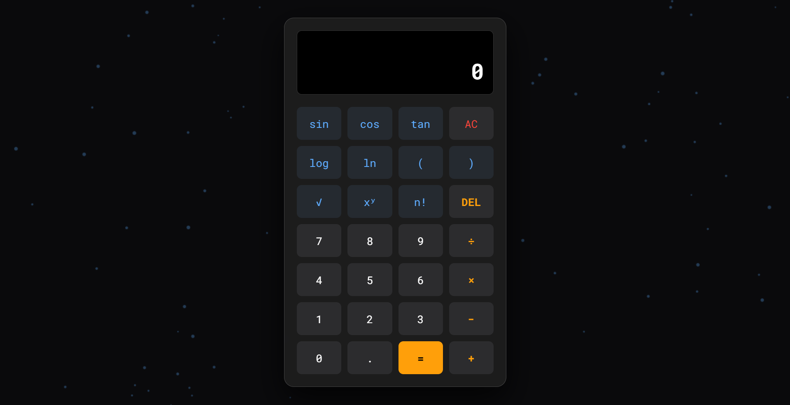

# 🌌 Pro-Logic Scientific Calculator

A high-performance, interactive scientific calculator designed for professionals who value both aesthetics and precision.  
Built to eliminate visibility issues in dark UIs using a high-contrast, safety-focused color palette and a clean monospaced interface.

---
## 🔗 Live Demo  
👉 **Try it here:**  
https://<kalyanDev18>https://animated-pro-scientific-calculator.netlify.app/

---

## ✨ Key Features

- **High-Contrast UI** – Pure white digits with safety-orange operators for instant readability  
- **Scientific Functions** – sin, cos, tan, log, ln, √, xʸ, factorial  
- **Animated Plexus Background** – HTML5 Canvas particle network animation  
- **Glassmorphism Design** – Frosted glass calculator panel  
- **Tactile Interactions** – Smooth hover & click animations  
- **Keyboard Support** – Enter, Backspace, Escape, operators supported  

---

## 🧠 Technical Architecture

### 🔢 Parsing Logic
Uses a **String-to-Math Translator** that converts user-friendly symbols (`× ÷ √`) into executable JavaScript expressions while preserving operator precedence.

### ⚡ Performance Design
- Canvas rendering optimized for low CPU usage  
- CSS Grid ensures responsive scaling across all devices  
- No external libraries — 100% Vanilla JavaScript  

---

## 🛠️ Built With

- **Vanilla JavaScript (ES6+)**
- **HTML5 Canvas**
- **CSS3 (Grid + Glassmorphism)**
- **Google Fonts – Roboto Mono**

---

## 📸 Preview

---

## 📝 License
MIT License © 2026 Kalyan
